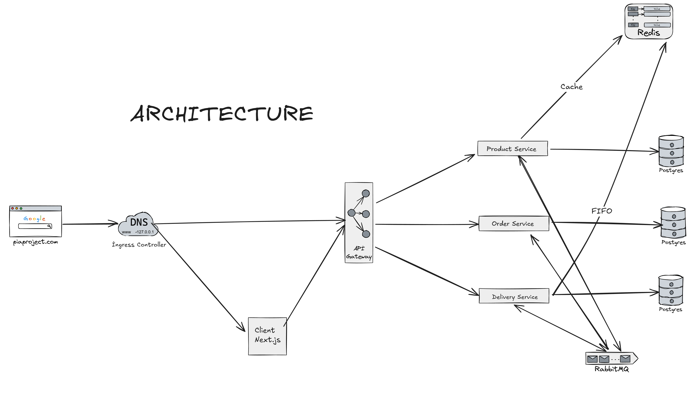
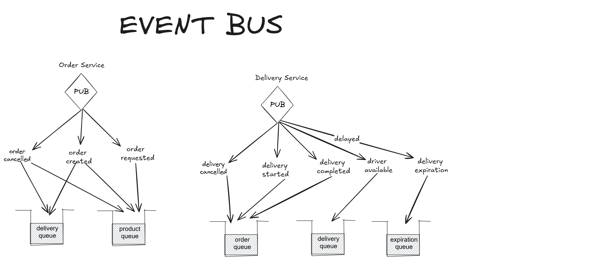

# Pia Microservice Project

## Microservice Mimarisi



[Ayrıntılar](https://erencelik.atlassian.net/wiki/external/Yjg2OTFmNmYxMjM2NGMyMGJkMTc1NmQ0MGViNGI2NmE)

## Event Bus



## Kurulum ve Uygulamanın Çalıştırılması

### Api Geliştirme Ortamı

Öncelikle `docker compose up -d` komutuyla gerekli database ve vb teknolojileri ayağa kaldırın. Ardından üç microservisi ve api-gatewayi de run ederek geliştirmeye başlayabilirsiniz.

product-service: 8080
order-service: 8081
delivery-service: 8083
api-gateway: 8082

portlarında çalışacaktır. Böylelikle istediğiniz serviste değişikliklerinizi yapıp anında hot-reload ederek değişikliklerinizi görebilirsiniz.

### Client Geliştirme Ortamı

Api geliştirme sürecinizi tamamladıysanız ve client yani frontend servisinde geliştirme yapacaksanız docker compose kullanarak bu işlemi daha rahat yapabilirsiniz

#### Servislerin Kurulumu

Aşağıdaki işlemler gateway dahil olmak üzere dört servis için de yapılmalıdır

- `mvn package -pl ${servisin-dosya-ismi} -Pdisable-jib -DskipTests`
- `docker build -f ${Servis.Dockerfile (Product.Dockerfile)} -t eren/pia-${servisin ismi tiresiz (productservice)} .`

bu işlemleri yapıp docker imageleri build aldıktan sonra docker compose -f docker-compose-prod.yml up komutunu çalıştırarak api kısmını çalıştırabilirsiniz.

api'ya 8080 portundan ulaşılabilir olacaktır.

Bu işlemlerden sonra client dosyasını girerek dev ortamını ayağa kaldırarak frontend tarafında geliştirmelerinize başlayabilirsiniz.

```
cd client
npm run dev
```

### Kubernetes Ortamı (Önerilen)

Burada uygulamayı tamamen bir şekilde kubernetes ortamında deploy edecek ve çalıştıracağız.

#### Servislerin Kurulumu

Aşağıdaki işlemler gateway dahil olmak üzere dört servis için de yapılmalıdır

- `mvn package -pl ${servisin-dosya-ismi} -Pdisable-jib -DskipTests`
- `docker build -f ${Servis.Dockerfile (Product.Dockerfile)} -t eren/pia-${servisin ismi tiresiz (productservice)} .`
- Client servisini ise cd client klasörüne girdikten sonra `docker build -t eren/pia-client` komutuyla build alıyoruz

#### Manifest Dosyalarının Deployment'ı

Öncelikle servisleri deploy etmeden önce kullandığımız ingress controller ile beraber uygulamamızı iki ayrı domainde host ediyoruz. Bunların çalışabilmesi için hosts dosyasını bu iki domaini eklemeliyiz. Nasıl yapılacağına dair [link](https://www.howtogeek.com/27350/beginner-geek-how-to-edit-your-hosts-file/)

```
127.0.0.1 api.piaproject.com
127.0.0.1 piaproject.com
```

Ardından [ingress-nginx'i](https://docs.nginx.com/nginx-ingress-controller/installation/installing-nic/installation-with-helm/) helm ile kurmalıyız.

Daha sonra aşağıda belirttiğim sıraya mümkün olduğunca uyumlu şekilde ilgili manifest dosyalarını deploy edebiliriz.

`kubectl apply -f ${dosya-adı}`

- product-postgres
- order-postgres
- delivery-postgres
- rabbitmq
- redis
- product-service
- order-service
- delivery-service
- api-gateway
- client
- prometheus
- grafana
- loki
- promtail

bu sırayla her klasördeki her .yaml manifest dosyasını kubernetes ortamında çalıştırıyoruz.

Her deployment işlemi bittikten bir süre sonra `kubectl get pods` ve `kubectl get services` komutlarını çalıştırırak status'lerinin Running olup olmadığını kontrol edebiliriz eğer running ise her şey çalışıyor demektir.

Eğer hata veren ya da crashloopback'e giren pod varsa `kubectl logs ${pod-ismi}` çalıştırarak podun neden hata verdiğini öğrenmek için loglara bakabiliriz.

Eğer her şey düzgün çalışıyorsa browserımızda piaproject.com adresine giderek uygulamamımızın ayağına kalkıp kalkmadığını kontrol edebiliriz.

#### Monitoring İçin Grafana

Öncelikle localhost:5000 adresine gidiyoruz ve 'admin' kullanıcı adı ve şifresiyle giriş yapıyoruz. Ardından menüden daha source'u seçip prometheus için http://prometheus:9090 ve loki için http://loki:3100 adreslerini kullanarak ekliyoruz.

Ardından new dashboard ekliyoruz. Gerekli dashboardların id'si ve hangi servisle ilişkilendirildikleri belirtilmiştir.

- 10991 - Rabbitmq monitoring - prometheus
- 4701 - Spring Boot monitoring - prometheus
- loglar için explore sekmesinde query çalıştırabiliriz tüm loglar için olan query `{app=~".+"}`
