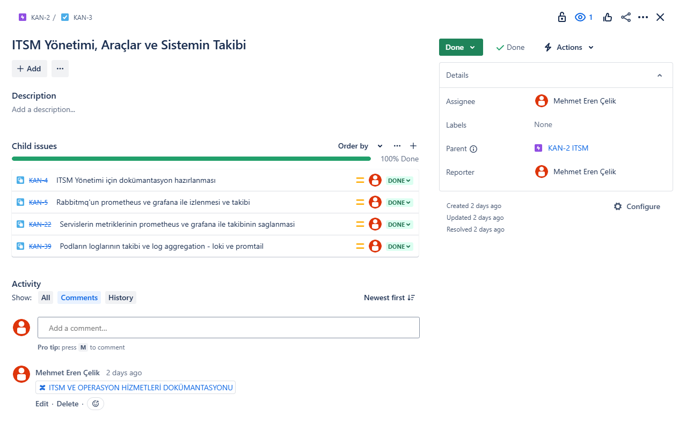

# Jira ve Jenkins Kullanımı

## Giriş

Bu doküman, yazılım geliştirme süreçlerinde Jira ve Jenkins'in nasıl ve niçin kullanıldığını açıklamaktadır.

## Jira Nedir?

Jira, Atlassian tarafından geliştirilen bir proje yönetim aracıdır. Yazılım geliştirme ekipleri tarafından yaygın olarak kullanılır ve aşağıdaki amaçlar için idealdir:

- **Görev Yönetimi:** Proje görevlerini oluşturma, atama ve takip etme.
- **Hata Takibi:** Yazılım hatalarını raporlama ve izleme.
- **Çevik Metodolojiler:** Scrum ve Kanban gibi çevik metodolojileri destekler.

## Jenkins Nedir?

Jenkins, açık kaynaklı bir otomasyon sunucusudur. Sürekli Entegrasyon (CI) ve Sürekli Teslimat (CD) süreçlerini otomatikleştirmek için kullanılır. Jenkins'in başlıca özellikleri şunlardır:

- **Otomatik Derleme:** Kod değişikliklerini otomatik olarak derler ve test eder.
- **Sürekli Entegrasyon:** Kodun sürekli olarak entegre edilmesini sağlar.
- **Eklenti Desteği:** Çok sayıda eklenti ile genişletilebilir.

## Neden Jira ve Jenkins Kullanmalıyız?

- **Verimlilik:** Görevlerin ve hataların yönetimi ile geliştirme sürecini daha verimli hale getirir.
- **Şeffaflık:** Proje ilerlemesini ve kod kalitesini sürekli olarak izleme imkanı sağlar.
- **Otomasyon:** Tekrarlayan görevleri otomatikleştirerek zaman kazandırır ve insan hatalarını azaltır.

## Sonuç

Jira ve Jenkins, yazılım geliştirme süreçlerini daha düzenli, verimli ve şeffaf hale getiren güçlü araçlardır. Bu araçları kullanarak, ekipler projelerini daha başarılı bir şekilde yönetebilir ve teslim edebilirler.

## Jirayı Nasıl Kullandım?

### Board

### Görevler

### Confluence Dokümantasyon

## Jenkinsi Nasıl Kullandım?

### Ortak Kütüphane

Mikroservislerin build aşamasında çok kez kullanılan aynı işlevi ortak bir kütüphaneye aktarıp oradan da jenkinse tanımlayarak kullandım ve daha temiz ve okunabilir bir pipeline oluşturabildim.

### Pipeline

Tüm servisler tek bir repoda olduğu için her pipeline çalıştığında tekrar tekrar her servisin build'ını almamak için önceki build alınan commitle pipeline çalışırken ki commit arasındaki farklara bakarak ilgili servisler değişmiş mi kontrol edip eğer bir değişiklik varsa ilgili servisleri build alıp docker imagelerini oluşturan bir pipeline oluşturarak bu süreci efektik bir şekilde yönetebildim.
